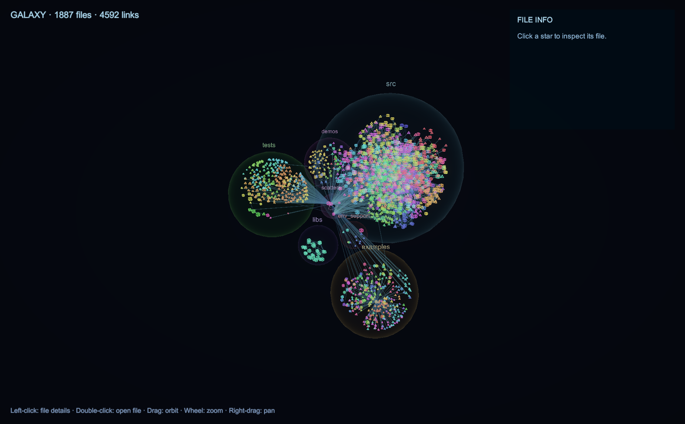
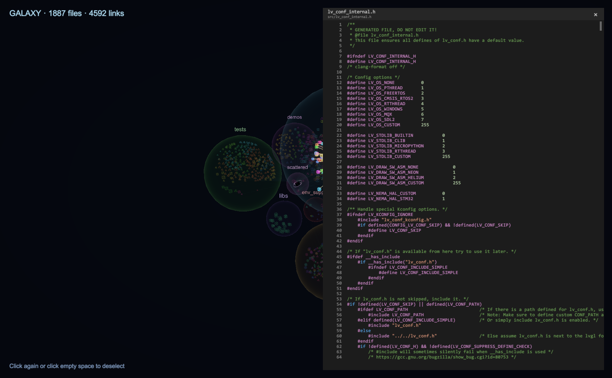
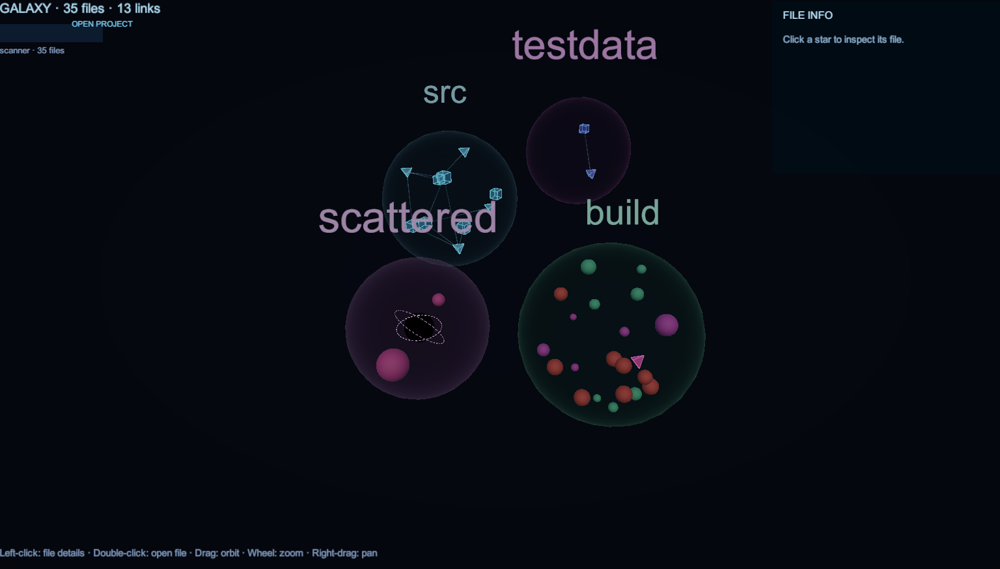

# galaxy

**Visualize any codebase as a 3D star chart.**

Every file becomes a celestial body, `#include` dependencies become light beams,
and each top-level folder grows into its own self-contained "universe" sphere.

[](https://www.gnu.org/licenses/gpl-3.0)


*[中文说明 →](README.zh-CN.md)*

## Screenshots







## Features

- **Four entity shapes**
  - Headers (`.h/.hpp/.hh/.hxx/.inl/.ipp/.tpp`) → transparent cubes
  - Sources (`.c/.cpp/.cc/.cxx`) → transparent tetrahedra
  - Other text files → emissive spheres tinted by directory
  - Binary files → **red spheres** (not viewable in the code viewer)
- **Universe spheres** — each top-level folder is wrapped in a Fresnel-rimmed
  sphere; radius = 1.9 × ∛(file count), packed so universes never intersect
- **Hierarchical gravity cores** — every subdirectory gets its own fixed
  gravity core, stronger the deeper it is. Universes condense into asymmetric
  clusters with voids instead of filling uniformly ("recursive star-cluster field")
- **Black hole** — the no-folder scattered universe hosts a small animated black
  hole (black core + two counter-rotating dashed accretion rings), sized ∝ ∛(file count)
- **Zero-intersection guarantee** — no two entity envelopes ever overlap
  (positional projection + local-clearance radius adaptation)
- **Picking & highlight** — click a star to light up its dependency chain
  (gold beams visible through foreground), dim everything else, and show file
  details in the HUD
- **Built-in code viewer** — double-click any text file to open a VS Code-style
  panel (dark theme, line numbers, C/C++ syntax highlighting, wheel paging,
  draggable scrollbar). Binary files are refused with a friendly notice
- **OPEN PROJECT** — rescan any folder at runtime from inside the desktop app;
  the scanner binary ships with the app, and the last project is remembered

## How it works

```
scanner/ (C++17)                    galaxy_project/ (Unity 6.6, URP)
  walk files ──┐                      JSON → force-directed layout inside
  sniff text/  ├─► galaxy.json ─────► per-folder universe spheres →
  binary       │   (deterministic,    entity meshes + link mesh + HUD +
  parse #include┘    schema v1)       picking / code viewer / desktop app
```

The scanner output is **byte-for-byte deterministic**: nodes are sorted by
normalized path, edges by `(source, target)` — the same codebase always yields
an identical `galaxy.json`, suitable for committing and regression testing.

## Getting Started

### Prerequisites

- **CMake** ≥ 3.16 + a C++17 compiler (for the scanner)
- **Unity 6000.6** with URP (for the renderer / desktop app)

### 1. Build the scanner

```bash
cmake -S scanner -B scanner/build -G Ninja
cmake --build scanner/build
```

### 2. Scan a project

```bash
scanner/build/bin/galaxy-scan <project-root> -o scanner/galaxy.json
```

```
usage: galaxy-scan <rootDir> [options]
  -o, --out <file>          output JSON path (default: galaxy.json)
  -I, --include-dir <dir>   extra header search dir (like compiler -I, repeatable)
  -x, --exclude <name>      exclude directories by name (any depth, repeatable)
      --compact             compact output
  -h, --help                show help
```

All files are scanned by default (including hidden and build directories);
symlinked directories (cycle safety) and unreadable directories are skipped.
For large repos, trim with e.g. `-x .git -x build`.

### 3. Run

**Desktop app (Windows)** — build it from the editor via the automated build
script (`Assets/Galaxy/Editor/GalaxyBuildPlayer.cs`, writes to `dist/Galaxy/`),
then:

```
dist\Galaxy\Galaxy.exe                     # bundled lvgl demo / last project
dist\Galaxy\Galaxy.exe --scan "D:\proj"    # scan a folder on startup
```

Or press **OPEN PROJECT** inside the app to pick a folder with the system
dialog. Scans show live elapsed time and can be cancelled; projects above the
10,000-node render limit are rejected with a hint to pick a subfolder.

**Unity Editor** — open `galaxy_project/` with Unity 6000.6, load
`Assets/Scenes/SampleScene.unity` and press Play. Data resolution order:
explicit jsonPath → last opened project (PlayerPrefs) → repo-default
`scanner/galaxy.json`.

## Controls

| Input | Action |
|---|---|
| Left-click a star | Highlight its dependency chain + file details |
| Left-click **double** | Open the code viewer (text files) |
| Drag / Wheel / Right-drag | Orbit / zoom / pan |
| Wheel over the viewer | Page through the file |
| Drag the viewer scrollbar | Jump straight to a position |
| Pointer over a panel | Camera input is suppressed entirely |

## Project structure

```
scanner/         C++17 scanner: walk + text/binary sniff + #include extraction
galaxy_project/  Unity 6.6 URP front-end
  Assets/Galaxy/Scripts/   runtime (layout, entities, picking, viewer, loader)
  Assets/Galaxy/Editor/    tooling (scene setup, autoplay, build script)
  Assets/Galaxy/Shaders/   custom shaders (overlay lines, Fresnel bubbles)
  Assets/StreamingAssets/  bundled scanner binary + demo data (for builds)
docs/images/     screenshots used in this README
```

## Data format (`galaxy.json`, schema v1)

```
nodes[]  { id, path, name, dir, lang, kind, bytes, lines }
         kind: "text" | "binary" (8 KB header sniff; legacy data says "file")
links[]  { source, target, kind: "include", weight }
stats    { files, links, unresolvedIncludes }
```

## Limitations

- Dependency extraction is C/C++ only (`#include`); other languages appear as
  nodes without links
- The layout is O(n²) — rendering is capped at ~10,000 nodes (the app refuses
  larger scans with a hint)
- Desktop builds are Windows-only for now
- UI text is English; code comments and logs are Chinese

## License

[GPL-3.0](LICENSE)
